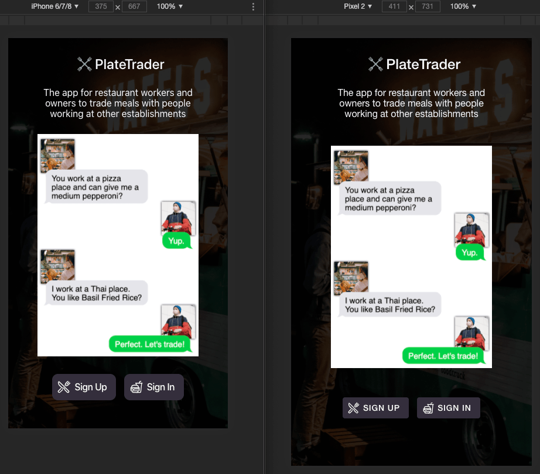

# PlateTrader

## Overview
PlateTrader is an independent project so that I can learn more about mobile development, with the goal of eventually publishing it to the App Store and Google Play Store.
For now, it's remaning a public repo.
Currently the only technology used is React (built with the Ionic CLI tool).
However, as it builds out it will probably incoporate React Leaflet or the Google Maps Platform API, and potentially switch to Vue after I'm more comfortable with how Ionic themes and structure works.
For the backend, I assume I'll use Node.js, but might experiment with something else down the road.

## Inspiration/Concept
The idea is to provide an app for people working in the food industry (whether employees or owners) to trade with eachother.
The concept has a couple inspirations:
(1) I used to work at a bakery, and the owners would often trade with a local pizza place. We'd give them cupcakes and cookies, they'd give us pizza. These deals were hard to faciitate, though, and it would be better if you could see all willings parties in an area.
(2) A user on Reddit, Raidhn, who suggested the idea more concentrely when I asked for app inspiration [here](https://www.reddit.com/r/Denver/comments/ffka8d/have_an_idea_for_a_simple_web_app_for_denverites/)

## User Stories Goals
- Create an account and add a profile photo
- Include a disclaimar that this is only for employees or owners of food and restaurants entities, to only use this ethically with permission
- Upload photos to your account of dishes and descriptions you are willing/able to trade
- Filter offers/acconts by location
- Send messages to other PlateTraders

## Contibutor's Guide
No way to contribute directly as of now. If you'd like to get in touch, you can reach me via my website, http://coreyhodge.net

## App home page screenshot (including mockup art of sample interaction)

